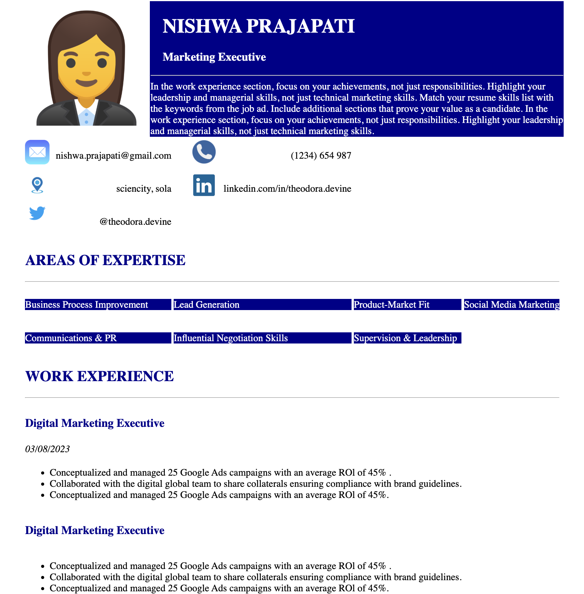

# Sample CV – HTML & CSS Implementation

This project is a simple and elegant resume (CV) layout built entirely using **HTML and CSS**. It represents a static personal profile webpage that can be used to showcase basic resume information in a structured, web-friendly format.



## Overview

This sample CV demonstrates how frontend technologies like HTML and CSS can be used to craft a clean, professional resume page. It highlights essential sections typically found in a marketing executive's resume, including:

- Profile summary
- Contact information
- Areas of expertise
- Work experience with timelines

The CV layout is responsive and lightweight, making it ideal for portfolio websites or digital resumes shared with recruiters and hiring managers.

## File Structure
frontend-project/ └── cv-sample/ ├── index.html # Main HTML structure ├── cv-image.png # Screenshot/Preview of the CV └── README.md # Project documentation

## Key Features

- Clean, readable layout using semantic HTML tags
- Custom styling using internal CSS
- Use of images/icons to enhance visual appeal
- Responsive sectioning for easy navigation and readability

## Technologies Used

- **HTML5** – For structuring content
- **CSS3** – For layout and styling

No JavaScript or external frameworks/libraries were used, keeping the project simple and beginner-friendly.

## How to Use

To preview or modify this resume:

1. Clone the repository:
   ```bash
   git clone https://github.com/Nishwa-Prajapati/Frontend-projects.git
